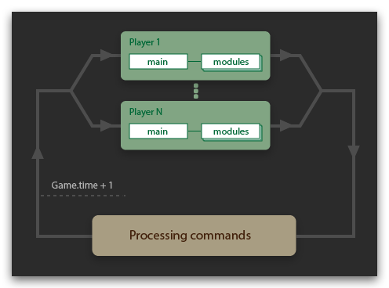
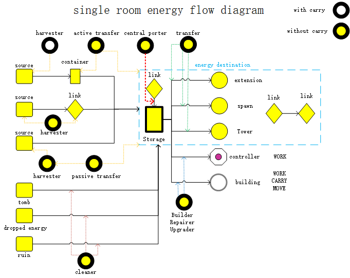

# 资料

## 游戏循环与tick内的动作执行

### Creep动作执行

对于单一creep

1. 同一tick内，不能执行所有动作。e

2. 同一tick内，具备完成动作的条件，相同的动作，只有最后一个会被成功执行

3. 同一tick内，执行多个不同的动作，当优先级产生冲突，执行优先级高的动作

4. 同一tick内，多个动作都具备完成的条件，低优先级的动作虽然被高优先级的动作覆盖，但也会返回OK（消耗0.2CPU）

### 动作执行优先级

1. 不同动作的执行结果仅和它们之间的优先级有关，与在代码中的先后顺序无关。

2. heal的优先级会覆盖harvester的优先级，但是heal和rangedAttack可以在一个tick内执行

3. 如果能量足够，相同动作最后一个执行，优先级冲突执行高优先级的任务。

4. 如果能量不足，参考能量不足时的优先级进行执行。

### 游戏循环

1. 游戏循环分为，初始、执行、结束三个阶段。

2. 初始阶段会重建所有游戏对象并记录游戏状态，如creep的位置
3. 执行阶段，玩家的代码被执行
   1. 同一tick内，先用了creep.move()再用了creep.attack()，发攻击的位置仍在移动前的位置，creep.pos将在下一tick的初始阶段进行更新
4. 结束阶段，统一处理那些改变游戏状态的动作，然后被传达到下一tick的初始阶段。

# 需求

## 长远目标

1. 获取更多资源
2. 扩展疆域
3. 提升武力值
4. 提高GCL
5. 提高GPL

## 最基本目标与需求

### 目标

1. 维持房间基本的运营
2. 提高RCL
3. 保证房间安全
4. 获取更多资源

### 需求

1. 采集能量
2. 生成creep
3. creep数量控制：集中式数量检查，硬编码版
4. 升级
5. 建造建筑
6. 维修
7. Tower基本防御

## 进阶目标与需求

### 目标

1. 提高程序健壮性，拥抱需求
2. 提高creep部件利用率，降低开销
3. 扩张，降低CPU开销
4. 更强大的防御

### 需求

1. 房间restart逻辑
2. 提高资源开采效率（如：挖运分离），降低creep部件开销
3. 面向多spawn的creep生成（creep生成控制及creep生成任务）
4. 主动防御
5. 自动调整creep部件数量

## 高级需求

1. 能量获取及运输如何减少运输成本
   1. 能量获取or采集位置太过于固定，如何尽可能从距离近的地方获取，减少运输成本
      1. 离那里近从哪里获取能量，尽可能减少运输总量，运输距离
   2. 能量运输目的地太过于固定，不够灵活，如何进行分配，减少运输成本
      1. 谁需要，优先给谁，而后再考虑存储及交易储备
   3. 运输成本最优最优并非是全局最优，在减少运输成本的同时需要保证关键任务的能量供给
2. 如何应对不同的房间适应不同的情况
3. 多Spawn生成creep如何分配与调度
4. Restart及对应不同level的房间的策略
   1. 房间出问题可以迅速恢复
   2. 检测当前状态
   3. 自动根据状态调整策略

# 挖运分离 提高Creep利用效率

## 能量流图与抽象角色设计

### 组件分析

WORK可用于harvester，以WORK为主，CARRY可有，可没有（与Container或其他creep配合）

WORK,CARRY可用于upgrader，builder，repairer，以WORK和CARRY为主

CARRY,MOVE可用于transfer，以携带和移动为主

不需要WORK的，transfer能量都只需要一下

Builder/Repairer/Upgrader/Harvester需要Worker

### 采集能源

#### 能量源头

自己房间，外矿

#### 传输目的地

自己房间内的能源建筑

### 三种采集方式

1. Harvester without carry和container配合，由active transfer运输

2. Harvester with carry和passive transfer配合完成
3. Harvester和link配合完成

### 能量流图

根据能量流图，采用挖运分离策略，有三种能量采集途径

1. 配备container采集能量

   creep角色设计

   1. harvester without carry：采集能源直接掉落在地上or container
   2. active transfer：主动取能源再运输

   要求：

   1. container一定与source相邻
   2. active transfer memory存source_container_idx, 从source_containers_id中查找id
   3. active transfer memory存source_roomName与dest_roomName（本房间不需要）
   4. 需要及时检查container是否有效

2. 配备link采集能量（效率最高，不需要transfer）

   creep角色设计

   1. harvester link，类似于harvester with carry，但是energy transfer给link，且需要类似于harvester without carry一样到达指定位置

   要求

   1. 只能在自己房间（其他房间不能建link）

3. 不配任何建筑采集能量

   creep角色设计

   1. harvester with carry：采集能源放在身上等passive transfer来运走（教程中由自己运走）
   2. passive transfer：被动接受能源再运输

   要求：

   1. passive transfer存source_idx，根据source_idx查找对应的harvester
   2. passive transfer存source_roomName与dest_roomName（本房间不需要）

其他角色

1. builder/repair/upgrader: WORK,CARRY,MOVE组件需要均衡
2. cleaner

### 抽象角色分析设计

其中Harvester具有不同的工作地点，transfer可能具有不同的start和end，而Builder也是。

在spawnCreep的时候就决定好，每一个具体的creep需要做的工作，而工作地点及源头相关的信息存储在Memory中

### 组件设计

1. Harvester设计
   1. 含有5个WORK，5个MOVE，保证移动
   2. 带有CARRY组件则需要transfer快速运走，不然就需要等待（瓶颈可能是transfer运不过来）

2. transfer：WORK CARRY 1:1的比例，只有两个组件可能会因为creep太多导致堵车，不过组件越多，花在等待上的时间越长

3. Builder/Repairer/Upgrader平衡比较好，MOVE是其他组件的两倍

### role任务设计

每一个具体的role完成一件非常具体的事情，如

1. Harvester without carry 到达指定地点，挖矿
2. Harvester with carry 到达指定地点挖矿，当容量中超过transfer单个的容量时，传输给transfer
3. active transfer 从某处取能量到某处
4. passive transfer 到某处，被给予能量再运输到某处
5. Builder/Repairer/Upgrader 从某处（近处？）取能量，到目的地点进行工作

